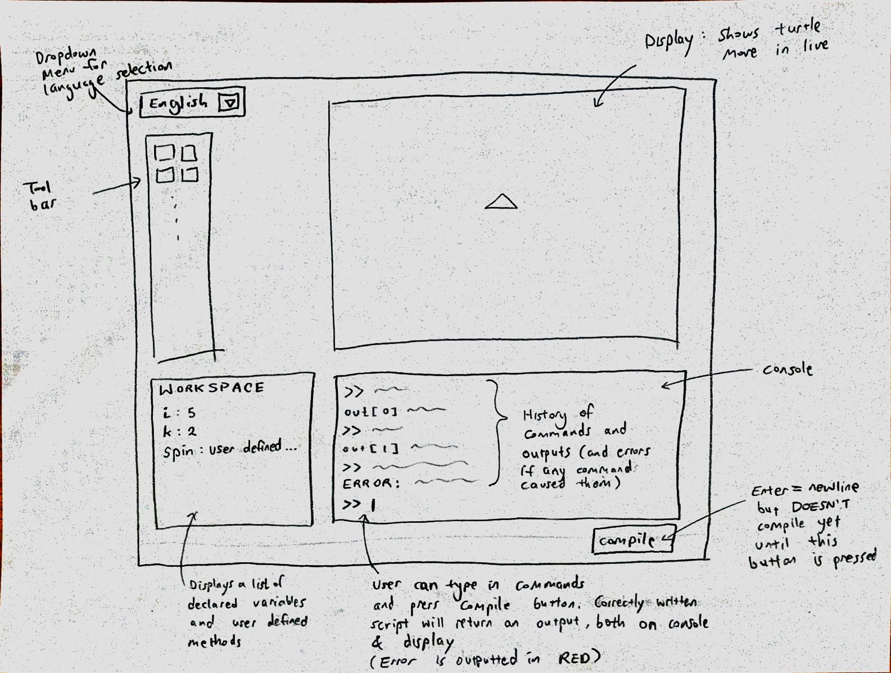

Design Plan for SLOGO Team 5
===================

### Introduction

The purpose of this project is to create an interactive environment for a user to input to commands and view the execution of these commands through both a graphical window and a text console. Users will also be able to use the GUI to easily access data such as created methods, variables, and previously used commands. The goal is to make the backend flexible by making it easy to add commands with new functionality, and to add new logical structures, such as while loops. The goal is to make the front end flexible by making it easy to give the user power to complete new actions, such as saving the state of a program. The front end is completely closed off from the backend, and the logic of the execution of commands is completely closed off from the front end. The main interaction between the front end and the backend is the front end obtaining commands from the user, which it then passes on to the backend to execute. The front end and backend have shared access to the graphical screen where the turtle's movements are displayed based on commands.

### User Interface

The basic user interface consists of four main items. The toolbox will contain several buttons to help the user customize their outputs. Options such as choosing the color/shape/size of the trail drawn by turtle can be set by the toolbox. Although it isn't directly a part of the toolbox, the language option can be decided by the dropdown menu, and this will change how the backend interprets the commands. 

The second main item in user interface is the display. The user doesn't directly interact with it, but the outcome of their commands will be displayed on the screen through this object. This allows the user to confirm that their command works as intended. It serves to display the final outcome that the user desires, as well as the process of reaching that outcome by showing the turtle move around the screen.

The third main item in user interface is the variable workspace. Much like other IDEs, our slogo UI will remember the declared variables and user defined methods. The user can directly interact with the window to either change each variable's stored value or even delete the variables. 

The last item is the console. This serves to allow the user to type in the wished commands to be compiled. It will display the history of commands as well as the output of each command (whether it be the evaluated value or error message), and there will be a text field at the very bottom for the user to input new commands/scripts. Pressing enter key creates new line, but will NOT compile the written text until the compile button is pressed (in which case everything that was written since the last compile will be compiled). The entered text is now displayed as the newest entry in history along with the output from that entry. The editable text field will now be clean for the user to enter more commands.

=======

### Design Overview

The Window Class is the Front End, and it is a cross between a View and a Controller. The Model Class is the Back End, and it is the Model.

The Back End, or the Model, will have absolutely no access to the Front End. This means that there is no Front End API. The Front End will delegate all logical command executing decisions to the BackEnd, which doesn't require the Front End's help to do these things.

The BackEnd API interface will consist of a executeCommand(String s, Display d) which takes in a string entered by the user and figures out whether it should thrown an error due to incorrect syntax or logic, or interpret the command written in the string and perform actions based on the command. The Front End will call this method when it gets access to the user entered commands. The Display object lets the backend know which display to edit. This method also returns a string which the front end will print on the GUI console. The interface will also consist of getVariableMap() and getUDMethodMap() which returns copies of its own Maps that give the front end access to data about variables and user defined methods so that users can view all the variables and user defined methods in their workspace. The BackEnd API also has a setLanguage(String l) so as to know which language of commands to interpret. The front end calls this method by seeing what the user enters.

The Front End internal interface consists of a method called render() which draws everything and structures and organizes the GUI. It also has method called addMenus(), which takes care of all the different menus. It also has a method called saveState(). Finally it has a method called findErrors() to throw errors from the users, and a method called createConsole() to create the GUI console with different functionalities. It also has a method called updateConsole(), where the console takes in string from the user and calls the executeCommand method, then updates the text console based on the results. This internal interface also has a method called addButtons() which adds all buttons for the user to interact with.

The Backend internal API contains the method protected void moveTurtle(Point init, Point dest, boolean pen) which moves the turtle.

### API Details 

**Front End External**
As we mentioned before, the back end of our program will have no need to access anything from the front end, so this part of the API is going to remain blank for now. 

**Back End External**
The API from the back end to the front end is used so that the front end can have access to interpreted and parsed commands as well as the lists of variables and functions defined by the user. The executeCommand method will serve this purpose most, interacting with the back-end parsing algorithm and having the back end convert that string into a series of movements that actually shifts the visual location of the turtle on the display. Here, the inclusion of a specified display class gives the flexibility to allow for concurrently running displays in the future. It will return either an error message or the evaluated return string, ensuring that the front end has access to what to return but still only has to control how that is displayed, rather than what is displayed. This method also needs to use the resource file corresponding to the selected language, which is one reason why the front end must also be able to set the language state of the back end. The user will also be inputting this language type, so it makes sense that the front end would pass this value off to the back end, as the back end is the component that actually uses the components of the language's resource file. This can easily be extended to take any other languages or to extend what values are covered in that resource file.

Finally, the two methods to return the user-defined functions and variables accesses these stored features. They must be stored in the back end, as this is the part of the program that needs to be able to access and use them. However, the front end must be able to display what these defined values look like, hence the need to give the front end access.

**Front End Internal**
The front end internal API primarily deals with working with the various objects that are going to be displayed on the screen. Methods like addMenus() and addConsole() will all be used to have the main front end controller take the Console and Menus and initialize them on the screen and later interact with them. This allows for easy extension as there can be different menu objects depending on what is being added to the screen. The render() method will have similar functionality, but is the larger method that incorporates all of the disparate components together. It will need to interact with and call for all of the menus, console, and create the larger Display class that the back end will also be interacting with. 

The saveState() method has a bit more reach, requiring the integration of the Console to be able to save the series of string commands that the user has input so that the drawing can be reinitialized at some point in the future. We discussed potentially trying to save the drawing itself depending on what functionality we find in Javafx, but for now, saving the ordering of commands will not only allow easy re-initialization, but will also allow the user to use the up arrow to recall previous commands even when just reloading a program.

Finally, the findErrors() method interacts with any potential errors that are flagged when other components of the front end have found errors that now need to be displayed on the front end, such as the console receiving an invalid script in the future.

**Back End Internal**
The back end's internal API deals with the movement of the turtle, as the main logic class must request that the display class actually move the turtle based off of a given command. This will take some translation in x and y so that the logic of calculating the movement is isolated out of the display class and so that the display can handle wrapping the turtle around the edges if need be rather than dealing with window bounds. It will also take a turtle in as an argument so that the program can eventually be extended to handle multiple turtles and just specify which is moving where, one at a time. The display, as mentioned, will have to interact with the front end, but the specification of where the turtle is moving based on a given command is still being handled at the back end. Most of the remaining methods in this API deal with changing the state of the turtle in different ways: setting the state of the pen, changing the orientation based off of a parsed command, or getting that heading from the Display class

### API Example Code

* The user types 'fd 50' in the command window, and sees the turtle move in the display window leaving a trail, and the command is added to the command history.
	* Window class- `addConsole(); // Adds the console`
	* Window class- `updateConsole(); //Takes in 'fd 50' from user, calls executeCommand with that string, and then gets the output string from executeCommand. Then this method prints both the user input string and the output from executeCommand on the console.`
	*  Model class- `executeCommand(Display d, String userinput); //This command takes in the display so that it can change the display based on 'fd 50'.`
* The user sets the language
	* Window class- `addMenus(); //sets up the Menus so that a user could go to the language menu and choose a menu.`
	* Model class- `setLanguage(String l); //based on the what the user set for the menu, setLanguage is called with a certain parameter, which determines which resources files are used for commands.`
* The user wants to see user created methods.
	* Window class- `addButtons(); //sets up buttons so that the user can press the button which brings up previous methods.`
	* Window class- `render(); //This method brings up everything that's seen on the GUI, including the list of methods.`
	* Model class- `getUDMethodMap(); //if the user created methods button is pressed, this method will be called, and the render method will go ahead and type these methods onto the screen.`
* The user wants to delete a variable from GUI.
	* Window class- `render(); //This method displays everything on GUI, including the workspace that lists all of the variables.`
	* Model class- `getVariableMap(); //The user can right click on the variable name, and select delete option to remove it from the map.`
* The user wants to save the current turtle display, console, and workspace.
	* Window class- `render(); //Initializes console, turtle display, and workspace, and puts them on the screen.`
	* Window class- `updateConsole(); //Updates the console to make sure that the last written command is compiled and the text field is empty`
	* Model class- `getVariableMap(); //Gets the map of variables to save so it can be loaded next time`
	* Model class- `getUDMEthodMap(); //Gets the map of user defined methods to save so it can be loaded next time`
	* Window class- `saveState(); //Saves all relevant information regarding current state of IDE`	
* The user wants to hide the turtle with the 'HT' command.
	* Window class- `addConsole(); // Adds the console`
	* Window class- `updateConsole(); //Takes in 'HT' from user, calls executeCommand with that string, and then gets the output string from executeCommand. Then this method prints both the user input string and the output from executeCommand on the console.`
	* Model class- `executeCommand(Display d, String userinput); //This command takes in the display so that it can change the display based on 'HT'.`
	* Display class- `setTurtleVisibility(false); sets the turtle visibility to false.`
* The user wants to turn the turtle 90 degress to the left and then move 50 units without drawing a trail. Enters the command 'RT 90 PU FD 50'
	* Window class- `addConsole(); // Adds the console`
	* Window class- `updateConsole(); //Takes in command from user, calls executeCommand with that string, and then gets the output string from executeCommand. Then this method prints both the user input string and the output from executeCommand on the console.`
	* Model class- `executeCommand(Display d, String userinput); //This command takes in the display so that it can change the display based on command.`
	* Display class - `turnRight(90); // turns the turtle 90 degrees to the right`
	* Display class - `setPen(false); //sets the pen up`
	* Display class - `getHeading(); //gets the new heading of the turtle`
	* Display class - `moveTurtle(new Point(50 * cos, 50 * sin)); //moves the turtle a total of 50 units based on the current heading`

### Design Considerations

Before attempting to devise a full design solution, we need to figure out how exactly the text console and and the user input text field will work together, and how to decide when to compile. We also need to know how to parse text from the Model, and how to deal with loops and other logic structures.

One design consideration we needed to make was how to allow the Window and the Model to share access to the display containing the turtle and its trail. The Window needed this display to show it on the overall window and edit it based on user requests through buttons, and the Model needs the display to edit it based on commands. There were two main options, have the Window initialize the Display object and the initialize the Model object with the Display object as a parameter in its constructor, or to have the Window initialize the Display object and then use it in the executeCommand call. The benefit of the first option is that there's less passing around of the Display object, and editing the Display object in the Model would be easier it it were an instance variable, instead of having to pass it around to all of the helper methods which need access to it. The problem with this option is that there's less flexibility in using multiple displays that the user has access to changing. The benefit of the second option is that the Window class would have greater flexibility in deciding which instance of a display object it wants the Model to edit according to user commands. However the problem is that it would be unwieldy to pass the Display object back and forth. We decided on the second option because it seemed like a good idea to have more flexibility so that there would be more control over how to utilize the Model.

We also debated whether the front end should have an external API which contained methods the backend would have access to. For instance, we considered having the Model call a Window method to update the list of user updated methods, or the list of variables, every time a new one was added due to a command. While this method seemed the most intuitive and efficient, the problem with this was data duplication, since both the Window and the Model would contain maps with the methods and variables. The other choice which we eventually went with was not having a front end API at all, and simply having Model methods to get variable and user defined maps which the Window would call when necessary. This would mean that the ultimate maps would only reside in one place, the Model, which makes sense since they're most necessary to the logic of the model. 

### Team Responsibilites

Madhavi- Front end, text console, previous commands, error throwing

Raphael- Front end, overall structure, menus, giving users access to information about methods/variables

Santo - Back end, string parsing, design handling for control structures

Ben - Back end, string parsing, design handling for moving of the turtle
